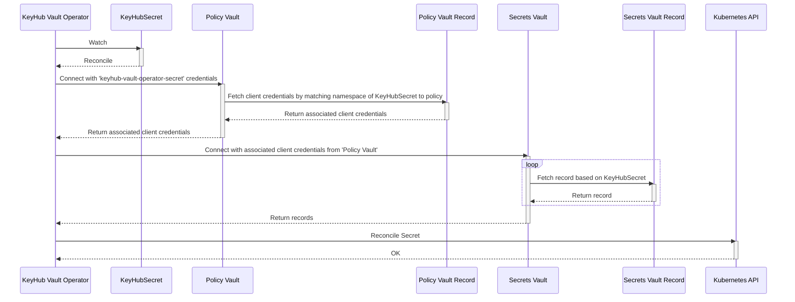

## Overview

The keyhub-vault-operator uses a policy based mechanism to access KeyHub vault records. These policies are stored in a KeyHub vault themselves, the 'Policy Vault'. The client credentials in the `keyhub-vault-operator-secret` Secret are used to access the 'Policy Vault'. The 'Policy Vault' contains additional client credentials (username/secret fields) to be used to access the vaults containing the secrets to be synced to Kubernetes, based on policies defined in the comment field.

These KeyHub applications must have the Give access to accounts and setup of groups option ticked. The keyhub-vault-operator reads the groups the application is linked to. All vault records in the vaults of the linked groups are available in the KeyHubSecret CR.



## Policy Vault access

The `keyhub-vault-operator-secret` Secret contains the following fields:
- **uri**: the url of your KeyHub instance
- **clientId**: KeyHub client application ID with access to the vault of your 'Policy Vault' KeyHub group
- **clientSecret**: KeyHub client application secret

## Policies

A policy defines a mapping between Kubernetes and a KeyHub OAuth2/OIDC application to be used to retrieve vault records. Currently only namespace-based policies defining a name (or a regex matching on the name) or a label selector are supported, e.g.:

```yaml
policies:
  - type: namespace
    name: default
  - type: namespace
    nameRegex: customer-.*
  - type: namespace
    labelSelector: field.cattle.io/projectId=p-xxxxx
```
